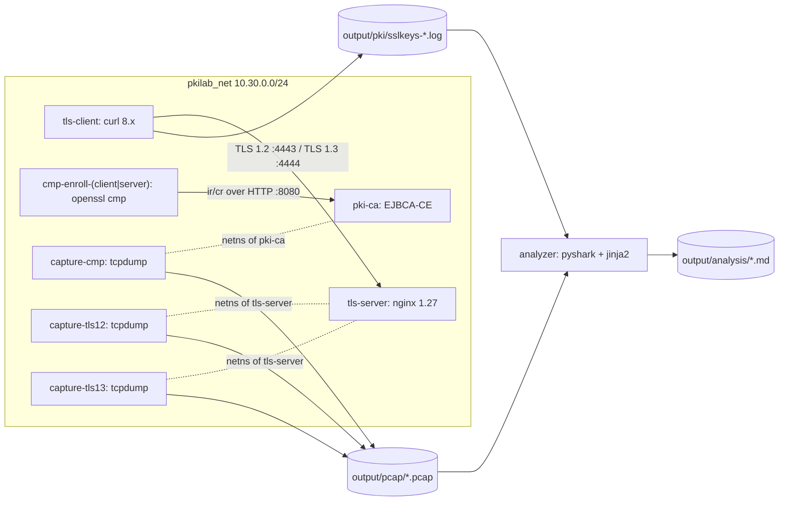
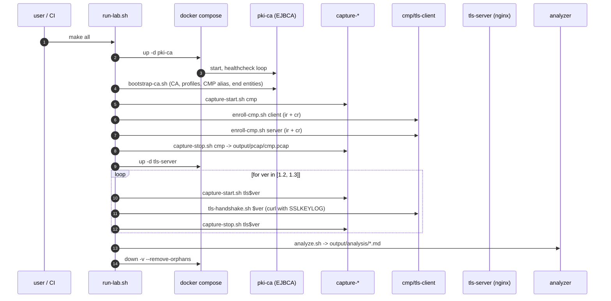

# PKI_TLS_Lab — Implementation Plan

## 1. Architecture



### Locked design decisions
- **CMP server**: EJBCA Community Edition (`keyfactor/ejbca-ce`), embedded H2 DB, single-tier `LabRootCA`.
- **CMP protection**: HMAC PBM on requests (`-secret pass:lab-cmp-secret-2026`), CA signature on responses; one alias `cmp-alias` in RA mode.
- **TLS server**: nginx 1.27 Alpine with two server blocks: TLS 1.2 on `:4443`, TLS 1.3 on `:4444`. mTLS via `ssl_verify_client on`.
- **TLS client**: curl 8.x with `--cert/--key/--cacert`, `SSLKEYLOGFILE` env populated for analyzer decryption.
- **Capture nodes**: per-scenario containers using `network_mode: container:<target>` (CMP scenario shares the CA's netns; TLS scenarios share the server's netns) — guarantees the right packets without bridge-flooding tweaks.
- **Crypto pinning** (deterministic captures): ECDSA P-256 throughout; TLS 1.2 cipher = `ECDHE-ECDSA-AES256-GCM-SHA384`; TLS 1.3 ciphersuite = `TLS_AES_256_GCM_SHA384` with `ecdsa_secp256r1_sha256`.
- **App data over TLS**: real HTTP/1.1 GET → nginx returns a real `index.html` plus headers `X-TLS-Version`, `X-TLS-Cipher`, `X-Client-CN` proving end-to-end mTLS.
- **Two CMP transactions per role**: first uses `-implicit_confirm` (2-message `ir`/`ip`), second uses `-cmd cr` without it (4-message `cr`/`cp`/`certConf`/`pkiConf`) — gives the analyzer richer content. Second cert is discarded.
- **Analysis output**: Markdown + auto-generated Mermaid sequence diagrams via `pyshark`. Four files: `00-overview.md`, `01-cmp-enrollment.md`, `02-tls12-handshake.md`, `03-tls13-handshake.md`.
- **Orchestration**: hybrid — `docker-compose.yml` for persistent infra (`pki-ca`, `tls-server`); a top-level `./run-lab.sh` plus focused per-phase scripts in `scripts/`. A thin `Makefile` exposes targets.
- **Re-runnability**: `make all` wipes `output/` first; per-phase targets are individually re-runnable; sentinel files prevent re-bootstrapping the CA.

## 2. Lifecycle



## 3. Project Layout (greenfield — all files new)

- [Makefile](Makefile) — one-line wrappers: `up`, `enroll`, `tls12`, `tls13`, `analyze`, `all`, `clean`, `down`, `test`.
- [run-lab.sh](run-lab.sh) — top-level orchestrator with `set -Eeuo pipefail`, `ERR` and `EXIT` traps, `tee` to `output/run.log`.
- [docker-compose.yml](docker-compose.yml) — `pkilab_net` bridge (subnet 10.30.0.0/24), `pki-ca` service with healthcheck, `tls-server` service under `profiles: [tls]`.
- [.env.example](.env.example) — `LAB_SUBNET`, `EJBCA_ADMIN_PASSWORD`, `CMP_SHARED_SECRET=lab-cmp-secret-2026`, `ECDSA_CURVE=P-256`, pinned ciphers, DNS aliases.
- [.gitignore](.gitignore) — excludes `output/`, `.env`.
- [README.md](README.md) — quickstart, prerequisites, per-phase reference, manual Wireshark instructions, troubleshooting.
- `scripts/`
  - [scripts/lib.sh](scripts/lib.sh) — `log()`, `wait_http()`, `srv_ip()`, `ensure_dirs()`, container-label helpers.
  - [scripts/bootstrap-ca.sh](scripts/bootstrap-ca.sh) — `docker exec pki-ca ejbca.sh` calls; idempotent; writes `output/pki/.ca-bootstrap.done`.
  - [scripts/enroll-cmp.sh](scripts/enroll-cmp.sh) — arg `client|server`; runs `cmp-enroll-<role>` container with the two `openssl cmp` invocations.
  - [scripts/capture-start.sh](scripts/capture-start.sh) — arg `cmp|tls12|tls13 [bpf]`; `docker run -d` with `network_mode: container:<target>`.
  - [scripts/capture-stop.sh](scripts/capture-stop.sh) — `docker stop --signal=SIGTERM`; verifies pcap is non-empty.
  - [scripts/tls-handshake.sh](scripts/tls-handshake.sh) — arg `1.2|1.3`; runs `tls-client` container with the right curl flags + `SSLKEYLOGFILE`.
  - [scripts/analyze.sh](scripts/analyze.sh) — runs `analyzer` with `--network none`.
  - [scripts/clean.sh](scripts/clean.sh) — removes labeled containers, removes network, `rm -rf output/`.
- `images/`
  - [images/tls-server/Dockerfile](images/tls-server/Dockerfile), [images/tls-server/nginx.conf](images/tls-server/nginx.conf), [images/tls-server/entrypoint.sh](images/tls-server/entrypoint.sh), [images/tls-server/html/index.html](images/tls-server/html/index.html).
  - [images/cmp-client/Dockerfile](images/cmp-client/Dockerfile) — alpine + `openssl 3.x`.
  - [images/tls-client/Dockerfile](images/tls-client/Dockerfile) — alpine + `curl 8.x` (OpenSSL build).
  - [images/capture/Dockerfile](images/capture/Dockerfile) — alpine + `tcpdump`.
  - [images/analyzer/Dockerfile](images/analyzer/Dockerfile), [images/analyzer/requirements.txt](images/analyzer/requirements.txt) — `python:3.12-slim` + `tshark` + `pyshark==0.6.*`, `cryptography>=43`, `jinja2>=3.1`, `pytest` (tests).
- `analyzer/`
  - [analyzer/__main__.py](analyzer/__main__.py), [analyzer/cmp.py](analyzer/cmp.py), [analyzer/tls.py](analyzer/tls.py), [analyzer/cert.py](analyzer/cert.py), [analyzer/mermaid.py](analyzer/mermaid.py), [analyzer/checks.py](analyzer/checks.py).
  - [analyzer/templates/00-overview.md.j2](analyzer/templates/00-overview.md.j2), [analyzer/templates/01-cmp.md.j2](analyzer/templates/01-cmp.md.j2), [analyzer/templates/02-tls12.md.j2](analyzer/templates/02-tls12.md.j2), [analyzer/templates/03-tls13.md.j2](analyzer/templates/03-tls13.md.j2).
- `config/ejbca/` — `ca.properties`, `certprofile-tls-{server,client}.xml`, `eeprofile-tls-{server,client}.xml`, `cmp-alias.properties`.
- `config/cmp-client/openssl-cmp.cnf` — shared CMP client options.
- `tests/` — `test_mermaid.py`, `test_cert.py`, `test_checks.py`, `tests/golden/` snapshot directory.
- `docs/` — [docs/architecture.md](docs/architecture.md), [docs/glossary.md](docs/glossary.md), [docs/superpowers/specs/2026-05-16-PKI_TLS_Lab-design.md](docs/superpowers/specs/2026-05-16-PKI_TLS_Lab-design.md) (full design doc, copied from this plan once Plan mode exits).
- `output/` (gitignored) — `pki/` (CA chain, end-entity keys/certs, SSLKEYLOG files, sentinels), `pcap/` (3 pcaps), `analysis/` (4 MD reports), `logs/` (per-phase logs), `run.log`.

## 4. Key Snippets

### CMP enrollment (per role) — `scripts/enroll-cmp.sh`
```bash
openssl genpkey -algorithm EC -pkeyopt ec_paramgen_curve:P-256 \
    -out /pki/${ROLE}.key.pem

openssl cmp -cmd ir \
    -server http://pki-ca:8080/ejbca/publicweb/cmp/cmp-alias \
    -ref tls${ROLE^}01 \
    -secret pass:${CMP_SHARED_SECRET} \
    -recipient "/CN=LabRootCA" \
    -subject  "/CN=${ROLE}.lab.local" \
    -newkey  /pki/${ROLE}.key.pem \
    -certout /pki/${ROLE}.cert.pem \
    -extracertsout /pki/${ROLE}.chain.pem \
    -trusted /pki/ca-chain.pem \
    -popo SIGNATURE -implicit_confirm

openssl cmp -cmd cr -server ... -ref ... -secret ... \
    -newkey /pki/${ROLE}.cr.key.pem -certout /pki/${ROLE}.cr.cert.pem
```

### nginx — `images/tls-server/nginx.conf`
- Two `server {}` blocks listening on 4443 (`ssl_protocols TLSv1.2; ssl_ciphers ECDHE-ECDSA-AES256-GCM-SHA384;`) and 4444 (`ssl_protocols TLSv1.3; ssl_conf_command Ciphersuites TLS_AES_256_GCM_SHA384; ssl_conf_command SignatureAlgorithms ecdsa_secp256r1_sha256;`).
- Both: `ssl_certificate /pki/server.cert.pem; ssl_certificate_key /pki/server.key.pem; ssl_verify_client on; ssl_client_certificate /pki/ca-chain.pem; ssl_ecdh_curve P-256;` and `add_header X-TLS-Version $ssl_protocol; add_header X-Client-CN $ssl_client_s_dn;`.

### TLS client — `scripts/tls-handshake.sh 1.3`
```bash
docker run --rm --network pkilab_net \
  -v "$PWD/output/pki:/pki" \
  -e SSLKEYLOGFILE=/pki/sslkeys-tls13.log \
  pkilab/tls-client \
  curl -sS --fail-with-body \
       --resolve tls-server.lab.local:4444:$(srv_ip) \
       --cacert /pki/ca-chain.pem --cert /pki/client.cert.pem --key /pki/client.key.pem \
       --tlsv1.3 --tls-max 1.3 --tls13-ciphers TLS_AES_256_GCM_SHA384 --curves P-256 \
       -D /pki/tls13-headers.txt https://tls-server.lab.local:4444/
```

### Capture — `scripts/capture-start.sh tls13`
```bash
docker run -d --rm --name capture-tls13 \
  --network container:tls-server \
  -v "$PWD/output/pcap:/pcap" \
  pkilab/capture \
  tcpdump -i any -U -s 0 -w /pcap/tls13.pcap "tcp port 4444"
sleep 0.5
```

### Analyzer entry — `analyzer/__main__.py`
- CLI: `--pcap-dir`, `--keylog-dir`, `--pki-dir`, `--out-dir`.
- Calls `cmp.analyze(...)`, `tls.analyze(..., version=1.2)`, `tls.analyze(..., version=1.3)`, then `checks.run_all(...)`, then renders the four Jinja2 templates.
- `tls.analyze` uses `pyshark.FileCapture(..., override_prefs={'tls.keylog_file': keylog_path})` so app-data records are decrypted.
- `mermaid.py` provides `Sequence().participant(...).msg(a, b, label, note=...)` builder; emits a fenced ` ```mermaid sequenceDiagram ... ``` ` block.

## 5. Sanity & Tests

- `analyzer/checks.py` (always-on inside `make analyze`): negotiated cipher / curve / sigalg matches the pinned values; cert chain verifies against `ca-chain.pem`; SAN matches `tls-server.lab.local`; CMP transactions all carry `status=accepted`. Any mismatch → non-zero exit.
- `make test` (hermetic, no lab needed): pytest over `analyzer/` covering Mermaid escaping, certificate parsing, and structural diff of generated reports against committed `tests/golden/` snapshots (ignoring randoms/timestamps).
- Smoke gate for CI: `make all && make test`.

## 6. Trade-offs Worth Calling Out

- **EJBCA is heavy** (~60 s first boot, ~2 GB RAM). Accepted because realism > startup time; healthcheck retries set to `60 × 5s`.
- **`network_mode: container:<X>` for capture** trades the bridge-tap purity of "a sniffer on the wire" for guaranteed visibility of the right packets in container land. Documented in `docs/architecture.md` because it's a real-world gotcha.
- **Single-tier CA** (no sub-CA) keeps the chain at length 2 in captures, which is easier to teach. Documented.
- **Pinned single cipher per TLS version** sacrifices "show negotiation" for byte-stable captures. The TLS 1.3 report includes one paragraph explaining how the negotiation *would* differ if multiple ciphers were offered.
- **Go-stack alternatives (Caddy) rejected** because the lab teaches OpenSSL/CMP, and consistency of the cipher names / curves between client/server/CA aids comprehension.
- **Server-side keylog not needed** — client SSLKEYLOG is sufficient for Wireshark/tshark to decrypt either direction.

## 7. Out of Scope (recorded so we don't drift)

- CRL/OCSP, HSM integration, EST, ACME, key escrow.
- TLS 1.0 / 1.1 / SSLv3 (deprecated).
- TCP-level pathologies, retransmission analysis, MTU tuning.
- Multiple tenants, concurrent enrollments, load testing.
- Web UI for browsing captures (the Markdown reports are the UI).
