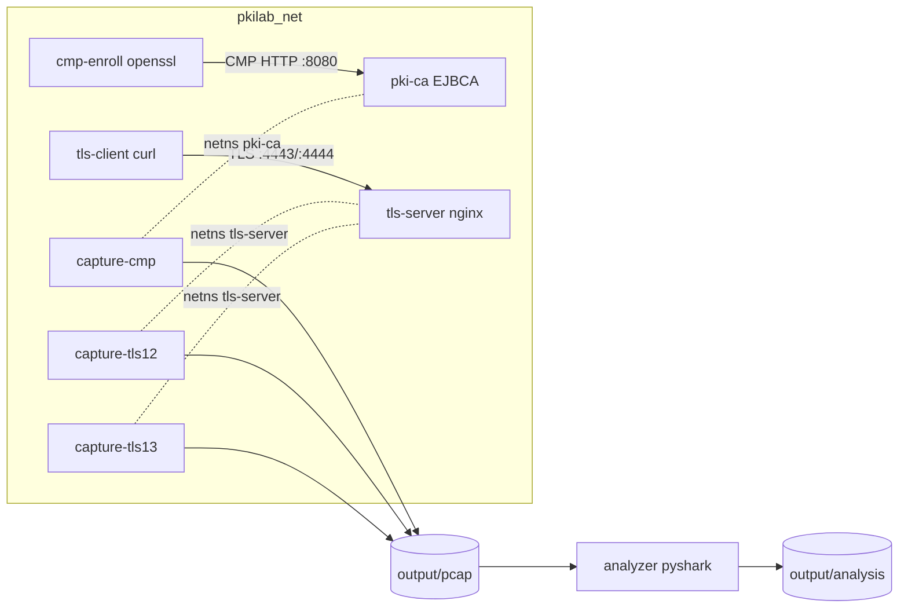

# PKI_TLS_Lab — Architecture

## Network

All lab containers attach to **`pkilab_net`** (`10.30.0.0/24`).

## Persistent vs ephemeral containers

| Container | Lifetime | Role |
|-----------|----------|------|
| `pki-ca` | `make up` … `make down` | EJBCA Community Edition |
| `tls-server` | `make tls12` onward | nginx TLS 1.2 (:4443) + 1.3 (:4444) |
| `capture-*` | One phase | tcpdump in target netns |
| `cmp-enroll-*` | One enroll | `openssl cmp` |
| `tls-client` | One handshake | curl mTLS |
| `analyzer` | `make analyze` | Offline report generation |

## Capture vantage (important)

Capture containers use **`--network container:<target>`** (share the target’s network namespace) instead of promiscuous sniffing on the Docker bridge.

On a Linux bridge, unicast between two other containers is **not flooded** to passive listeners — a sniffer on the bridge often sees nothing. Sharing the CA or server netns guarantees the capture sees traffic to/from that endpoint.

## Data flow

1. **Bootstrap** — `scripts/bootstrap-ca.sh` configures LabRootCA (ECDSA P-256), cert/EE profiles, CMP alias `cmp-alias`, end entities `tlsClient01` / `tlsServer01`.
2. **Enroll** — `openssl cmp` generates keys locally, submits IR/CR to EJBCA; certs land in `output/pki/`.
3. **TLS** — nginx presents `server.cert.pem`; curl presents `client.cert.pem`; both trust `ca-chain.pem`.
4. **Analyze** — pyshark + tshark decode pcaps; Jinja2 renders Markdown reports with Mermaid diagrams.
