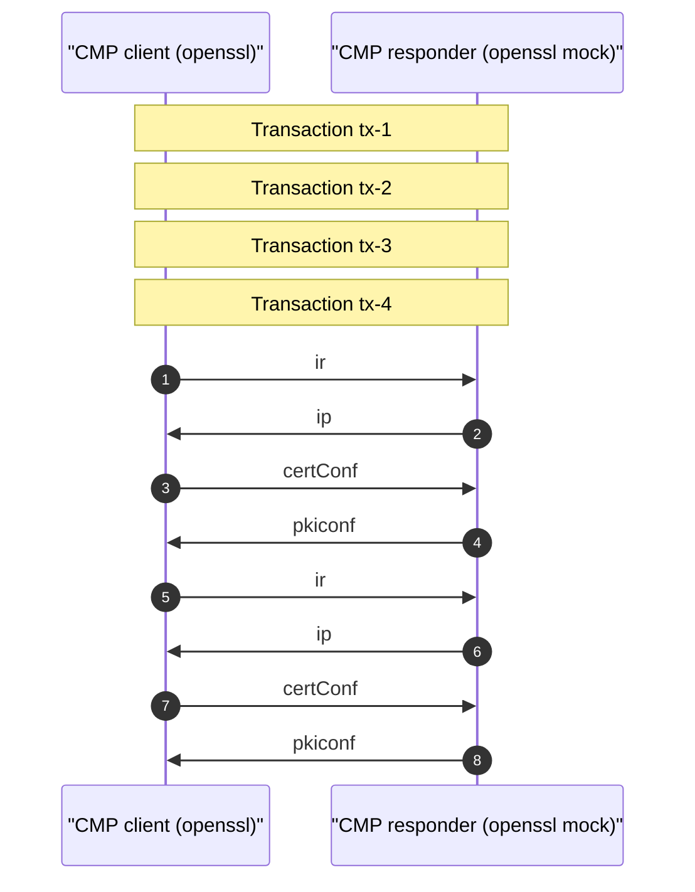

# CMP Enrollment — Protocol Analysis

Certificate enrollment via **CMP** (RFC 4210) against an **OpenSSL CMP mock responder** using **ECDSA P-256** keys. The client (`openssl cmp`) authenticates requests with a **shared secret** and the responder signs replies with the **Lab Root CA**'s ECDSA key.

## 1. Capture summary

- **pcap**: `output/pcap/cmp.pcap`
- **Packets (total in filter)**: 8
- **CMP messages decoded**: 8

## 2. Enrollment at a glance

## 3. Message table

| Time | Direction | PKIBody | Transaction ID | Protection |
|------|-----------|---------|----------------|------------|
| 2026-05-16 14:23:17.879062 | 10.30.0.3 -> 10.30.0.2 | ir | ? | (see ASN.1) |
| 2026-05-16 14:23:17.881208 | 10.30.0.2 -> 10.30.0.3 | ip | ? | (see ASN.1) |
| 2026-05-16 14:23:17.923722 | 10.30.0.3 -> 10.30.0.2 | certConf | ? | (see ASN.1) |
| 2026-05-16 14:23:17.924035 | 10.30.0.2 -> 10.30.0.3 | pkiconf | ? | (see ASN.1) |
| 2026-05-16 14:23:19.157176 | 10.30.0.3 -> 10.30.0.2 | ir | ? | (see ASN.1) |
| 2026-05-16 14:23:19.159817 | 10.30.0.2 -> 10.30.0.3 | ip | ? | (see ASN.1) |
| 2026-05-16 14:23:19.203748 | 10.30.0.3 -> 10.30.0.2 | certConf | ? | (see ASN.1) |
| 2026-05-16 14:23:19.204087 | 10.30.0.2 -> 10.30.0.3 | pkiconf | ? | (see ASN.1) |

## 4. PKIBody types observed

The lab runs **two transactions per role** (client and server):

1. **Initialization Request (`ir`)** with `-implicit_confirm` — minimal 2-message exchange (`ir` → `ip`).
2. **Certificate Request (`cr`)** without implicit confirm — full 4-message exchange (`cr` → `cp` → `certConf` → `pkiConf`).

| PKIBody | Tag | Direction (typical) |
|---------|-----|---------------------|
| ir | 0 | client → CA |
| ip | 1 | CA → client |
| cr | 2 | client → CA |
| cp | 3 | CA → client |
| certConf | 24 | client → CA |
| pkiConf | 19 | CA → client |

## 5. Protection algorithms

- **Request**: `id-PasswordBasedMac` (HMAC-SHA1 OWF) with shared secret configured on the CMP alias.
- **Response**: ECDSA signature with the CA key (`ecdsa-with-SHA256` on P-256).

## 6. Wireshark tips

Open `cmp.pcap` and filter `cmp`. Expand **Certificate Management Protocol** → **PKIMessage** → **PKIBody** to inspect ASN.1 structure.