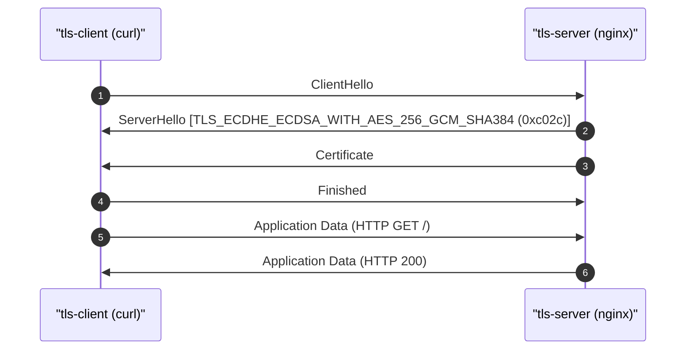

# TLS 1.2 Handshake — Mutual Authentication with ECDSA P-256

## 1. Capture summary

- **pcap**: `output/pcap/tls12.pcap`
- **Packets**: 6
- **Duration**: ~6.3 ms
- **Client → Server**: 10.30.0.4 → 10.30.0.3:4443
- **Decryption**: `output/pki/sslkeys-tls12.log` (client SSLKEYLOG)

## 2. Handshake at a glance

## 3. Negotiated parameters

| Parameter | Value |
|-----------|-------|
| Protocol | TLS 1.2 |
| Cipher | TLS_ECDHE_ECDSA_WITH_AES_256_GCM_SHA384 (0xc02c) |
| Key exchange | ECDHE on P-256 |
| Signature algorithm | ecdsa_secp256r1_sha256 (0x0403) |
| Client auth | mTLS (client Certificate + CertificateVerify) |

## 4. Per-message walk-through

### 1. ClientHello (packet #4)

- Time: 2026-05-16 14:24:18.390308
- Cipher: 0xc02c
- Signature algorithm: 0x0403
- Length: 168 bytes

### 2. ServerHello (packet #6)

- Time: 2026-05-16 14:24:18.392767
- Cipher: 0xc02c
- Signature algorithm: 0x0403
- Length: 108 bytes

### 3. Certificate (packet #8)

- Time: 2026-05-16 14:24:18.394393
- Signature algorithm: 0x0403
- Length: 965 bytes

### 4. Finished (packet #9)

- Time: 2026-05-16 14:24:18.395759
- Length: 12 bytes

## 5. Application data

- Application data bytes (approx): 0
- GET / HTTP/1.1 (decrypted when keylog present)
- HTTP/1.1 200 OK (nginx index.html)
- nginx sets `X-TLS-Version`, `X-TLS-Cipher`, and `X-Client-CN` response headers when mTLS succeeds.

## 6. Comparison to TLS 1.3

See [03-tls13-handshake.md](03-tls13-handshake.md). TLS 1.3 encrypts most handshake messages after ServerHello; TLS 1.2 exposes Certificate and ServerKeyExchange in cleartext.