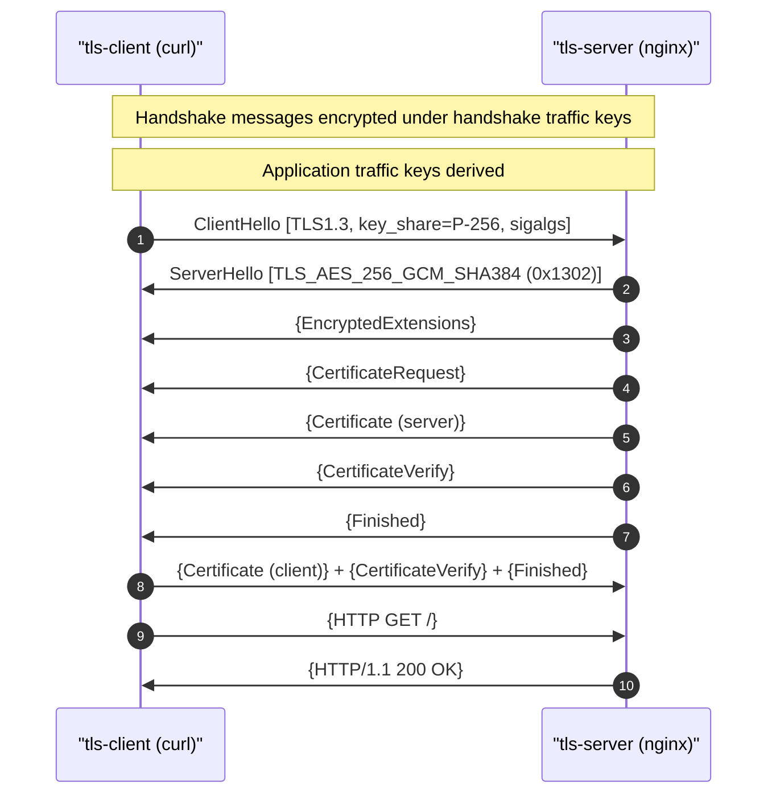

# TLS 1.3 Handshake — Mutual Authentication with ECDSA P-256

## 1. Capture summary

- **pcap**: `output/pcap/tls13.pcap`
- **Packets**: 7
- **Duration**: ~4.0 ms
- **Client → Server**: 10.30.0.4 → 10.30.0.3:4444
- **Decryption**: `output/pki/sslkeys-tls13.log` (client SSLKEYLOG)

## 2. Handshake at a glance

## 3. Negotiated parameters

| Parameter | Value |
|-----------|-------|
| Protocol | TLS 1.3 |
| Ciphersuite | TLS_AES_256_GCM_SHA384 (0x1302) |
| Key share | secp256r1 (P-256) |
| Signature scheme | ecdsa_secp256r1_sha256 (0x0403) |
| Client auth | mTLS |

## 4. Per-message walk-through

### 1. ClientHello (packet #4)

- Time: 2026-05-16 14:24:22.688884
- Cipher / suite: 0x1302
- Sig scheme: 0x0403
- Length: 508 bytes

### 2. ServerHello (packet #6)

- Time: 2026-05-16 14:24:22.690036
- Cipher / suite: 0x1302
- Sig scheme: 0x0403
- Length: 151 bytes

### 3. Certificate (packet #8)

- Time: 2026-05-16 14:24:22.691438
- Sig scheme: 0x0403
- Length: 970 bytes

### 4. NewSessionTicket (packet #11)

- Time: 2026-05-16 14:24:22.692502
- Length: 805 bytes

### 5. NewSessionTicket (packet #12)

- Time: 2026-05-16 14:24:22.692703
- Length: 805 bytes

## 5. Encrypted handshake note

After **ServerHello**, TLS 1.3 protects subsequent handshake messages with **handshake traffic keys**. Wireshark/tshark need the **SSLKEYLOG** file from the curl client to decrypt **EncryptedExtensions**, **Certificate**, **CertificateVerify**, and **Finished** records.

## 6. Application data

- Application data bytes (approx): 0
- GET / HTTP/1.1 (decrypted when keylog present)
- HTTP/1.1 200 OK (nginx index.html)

## 7. Negotiation vs. this lab

This lab pins a **single ciphersuite** per listener for deterministic captures. In production, ClientHello would offer multiple suites and the server would pick one — the message order remains similar but extension lists grow.